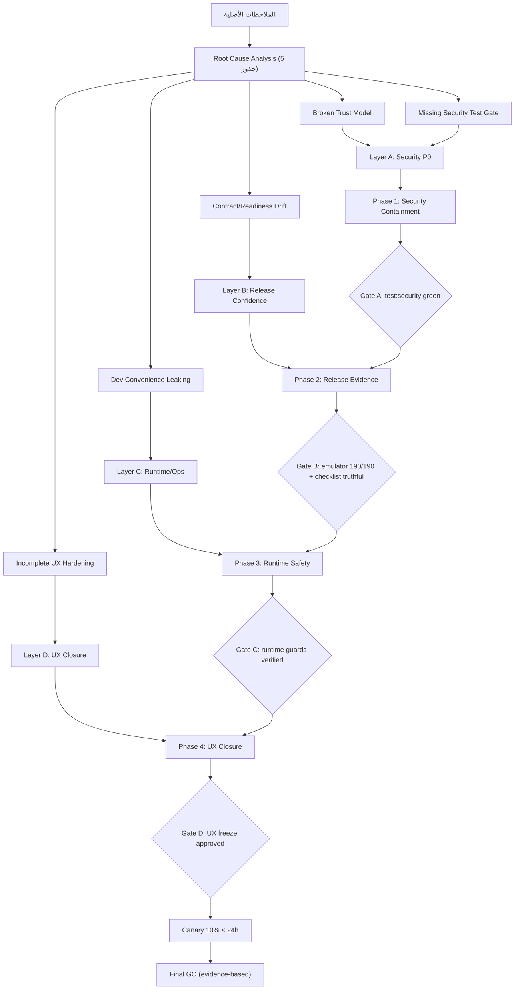
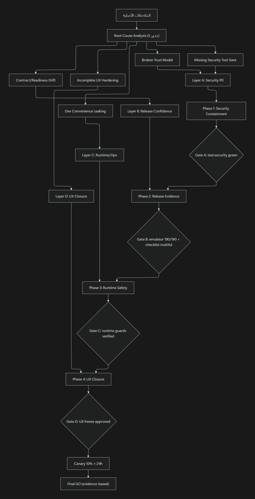

## 1) Executive Decision

<aside>
🚨

**القرار الحالي: NO-GO مؤقت.** اللوحة قوية هندسيًا (312/312 اختبار أمامي، build نظيف)، لكن لا تزال هناك **موانع إطلاق حقيقية** في ثلاث طبقات متمايزة: Security P0، Release-confidence، وRuntime/UX debt.

</aside>

**المبدأ الحاكم**: لا يتحرك أي تحسين بصري أو UX قبل إغلاق طبقة الثقة الأمنية.

**الترتيب الصارم**:

`Trust Model → Release Evidence → Runtime Safety → UX Closure`

**الإجمالي الواقعي**: 4–8 أيام عمل مركّزة.

---

## 2) Launch Blocking Model

بعد دمج أفضل ما في النسختين، صنّفنا الموانع إلى **أربع طبقات متمايزة** بدل خلطها تحت P0/P1:

### A. Security P0 Blockers — تمنع الإطلاق فورًا

| ID | المشكلة | القرار |
| --- | --- | --- |
| **SEC-1** | قبول session context من headers قابلة للتزوير | Blocker |
| **SEC-2** | fallback إلى `super_admin` عند غياب role | Blocker |
| **SEC-3** | اعتماد production على `NEXT_PUBLIC_*` privileged tokens | Blocker (Two-Phase) |

### B. Release-Confidence Blockers — تمنع إعلان readiness بثقة

| ID | المشكلة | القرار |
| --- | --- | --- |
| **REL-1** | export/contract drift في `rebuildWalletReportForVenue` | Blocker until clarified |
| **REL-2** | `verify_wallet_env.js` يعتمد على source text قديم | Blocker |
| **REL-3** | checklist يعلن `GO_LIVE_READY` رغم blockers مفتوحة | Blocker |

### C. Runtime / Operational Issues — لا تسبق الأمن لكن لا يجب أن تبقى عند Go

| ID | المشكلة | القرار |
| --- | --- | --- |
| **OPS-1** | loaders حساسة تبدأ قبل authorization | High |
| **OPS-2** | fixture fallback في مسار إنتاجي | High |
| **OPS-3** | لا observability كافية لمحاولات الرفض | High |

### D. UX / Content Closure — لازمة لإغلاق التجربة بعد الأمان

| ID | المشكلة | القرار |
| --- | --- | --- |
| **UX-1** | `/admin/config` غير مغلقة UXيًا | Medium |
| **UX-2** | مصطلحات إنجليزية + JSON خام في venue-create-dialog | Medium |
| **UX-3** | `toLocaleDateString()` بلا locale ثابت | Medium |

---

## 3) Root Cause Model

### Root Cause 1 — Broken Trust Model

المشكلة ليست bugs منفصلة، بل طبقة الجلسة تسمح بمصادر ثقة متعددة بعضها غير محكوم بـ `default-deny`: headers قابلة للتزوير + `super_admin` fallback + privileged tokens على العميل + loaders تسبق التحقق.

### Root Cause 2 — Contract / Readiness Drift

الكود والاختبارات والوثائق لم تعد فوق نفس العقد: export gap، verify script stale، checklist قديم، readiness signal غير موحد.

### Root Cause 3 — Dev Convenience Leaking into Production

قرارات مقبولة في dev تسرّبت للإنتاج: header shortcuts، public tokens، fixture fallback، readiness docs غير مؤتمتة.

### Root Cause 4 — Incomplete Admin UX Hardening

واجهات schema-driven أكثر من task-driven: `/admin/config`، venue creation، date/Arabic consistency.

### Root Cause 5 (مستنتج) — Missing Security Test Gate

لا يوجد `test:security` كبوابة CI مستقلة تفشل عند عودة أي سلوك خطر.

---

## 4) Environment Policy Matrix (Phase 1 Deliverable)

<aside>
🛡️

هذه المصفوفة تُكتب وتُدمج في Phase 1 كـ **deliverable رسمي**، وتمنع 80% من dev convenience leaks مستقبلًا.

</aside>

| Capability | local | staging | production |
| --- | --- | --- | --- |
| Header-based session (`x-wain-admin-*`) | ✅ | ⚠️ default off + feature flag داخلي فقط | ❌ ممنوع |
| `NEXT_PUBLIC_*_AUTH_TOKEN` | ✅ | ❌ | ❌ (env validation يفشل) |
| `NEXT_PUBLIC_*_APP_CHECK_TOKEN` | ✅ | ❌ | ❌ |
| Fixture fallback | ✅ | ⚠️ explicit | ❌ |
| `super_admin` fallback عند missing role | ❌ | ❌ | ❌ |
| Server-side command proxy | ✅ اختياري | ✅ | ✅ إجباري |

---

## 5) Final Prioritized Fix Plan

### SEC-1 — Header-based session trust

**القرار**: Production ممنوع تمامًا. Staging/Dev مسموح فقط خلف feature flag داخلي يكون `default off`، ولا يعمل إلا عندما يكون `NODE_ENV !== "production"` ومع env صريح مثل `WAIN_ENABLE_UNSAFE_ADMIN_HEADER_SESSION=true`. **لا HMAC الآن** (تعقيد سابق لأوانه).

- **Owner**: Backend/Auth
- **Secondary**: Security reviewer
- **النوع**: Security hardening + partial redesign
- **المدة**: 0.5–1 يوم
- **Exit Evidence**:
    - [x]  test: forged `x-wain-admin-*` → 401
    - [x]  test: production يتجاهل header-based session بالكامل
    - [x]  smoke على routes محمية يمر بـ legit session فقط
- **Progress Note (2026-04-19 / AWC-RC-050)**: اختبارات `forged-header-denied` أصبحت مثبتة ضمن `test:security`، وتمت إضافة `route-guards.security.test.ts` كدليل route-level بأن المسارات المحمية لا تقبل جلسة غير موثقة أو دور غير مصرح، وتسمح فقط بجلسة admin صالحة.
- **Progress Note (2026-04-19 / AWC-RC-051)**: تم إغلاق نقطة `WAIN_ADMIN_SESSION_JSON` بإضافة guard إنتاجي في `session-server` يجعل هذا المصدر غير فعّال في production، مع اختبار صريح يثبت رفضه ضمن `forged-header-denied.test.ts`.
- **Rollback**: feature flag في staging فقط. لا rollback في production.

### SEC-2 — Missing role becomes super_admin

**القرار**: **fail-closed**. no role → deny، invalid role → deny، disabled → deny.

- **Owner**: Backend/Auth + Admin data owner
- **النوع**: Quick win أمني
- **المدة**: 0.5 يوم
- **Migration Sequence (إلزامي قبل الدمج)**:
    1. Query يعدّ ويصدّر قائمة الحسابات بلا role (قبل التعديل).
    2. قرار لكل حساب: deactivate أو assign minimal role صراحةً.
    3. تنفيذ الـ migration في نافذة صيانة.
    4. نشر إصلاح الكود (إزالة fallback).
- **Exit Evidence**:
    - [x]  test: missing role → denied
    - [x]  test: unknown role → denied
    - [x]  report: قائمة الحسابات القديمة مُعالَجة بالكامل
- **Progress Note (2026-04-19 / AWC-RC-049)**: تم تفعيل `claims-only` في حل الأدوار (fail-closed) وإلغاء منح الصلاحيات عبر fallback context، واختبارات `missing-role-denied` و`guard-api` أصبحت تغطي هذا السلوك. تم توليد تقريري تدقيق `admins` على `demo-wain-analytics` و`wain-d2e28` (الهدف) مع `0` findings (`missing_role`/`invalid_role`) في تقرير الهدف.
- **Rollback**: لا rollback للسلوك القديم. فقط rollback للـ deployment إن ظهرت حسابات حرجة.

### SEC-3 — `NEXT_PUBLIC_*` privileged tokens (Two-Phase)

#### Phase A — Containment (فوري، 0.5 يوم)

- منع أي `NEXT_PUBLIC_WAIN_*_AUTH_TOKEN` أو `..._APP_CHECK_TOKEN` من production config.
- تحديث runbook و`start-live-admin-web.ps1` لمنع الاستخدام الإنتاجي.
- env validation يفشل البناء إذا وُجد أي توكن privileged في `NEXT_PUBLIC_*` في production.

#### Phase B — Redesign (1–2.5 يوم)

- إنشاء server-side proxy / BFF: `app/api/admin/command/[domain]/route.ts`.
- المتصفح يستدعي `/api/admin/command/[domain]` بجلسة الأدمن الحالية، ولا يحمل أي privileged token في env أو bundle أو storage.
- الـ API route يثبت session/RBAC server-side، ثم ينفذ الأمر أو يمرره إلى Cloud Function بهوية موثوقة من السيرفر.
- App Check الحقيقي يبقى إشارة حماية وقت التنفيذ، لكن بدون أي static public privileged token.
- العقد النهائي: لا يوجد production path يعتمد على `NEXT_PUBLIC_*` privileged tokens.
- **Owner**: Backend/API + Frontend integration
- **Exit Evidence**:
    - [x]  production env validation يفشل عند وجود public privileged token
    - [x]  كل domains الأمرية (finance/config/content/media/reviews/venues) عبر server-side path في production
    - [x]  فحص bundle: لا توكن privileged في كود المتصفح
- **Progress Note (2026-04-19 / AWC-RC-048)**: تم إضافة env guard + bundle sentinel scan على build/CI وإصلاح أخطاء TypeScript الخاصة بمرحلة finance proxy، لكن هذا لا يُغلق `SEC-1` أو `SEC-2` حتى يكتمل session hardening.
- **Progress Note (2026-04-19 / AWC-RC-052)**: تم تعميم `SEC-3 Phase B` على كل domains الأمرية: إضافة server routes تحت `/api/admin/command/{config,content,finance,media,reviews,venues}` مع تحقق session/RBAC قبل تمرير callable، وإضافة proxy transports + mode resolvers في default transports لكل domain بحيث production + live functions URL يمر عبر proxy فقط؛ التحقق مر عبر Vitest مركز (5 ملفات / 15 اختبارًا) + `tsc --noEmit` + `npm run build:secure` (env guard + bundle sentinel scan أخضر).
- **Rollback**: rollback لآخر deployment آمن. لا عودة لـ `NEXT_PUBLIC_*` في production.

### REL-1 — Export / public contract ambiguity

<aside>
⚠️

**ملاحظة مهمة**: `rebuildWalletReportForVenue` اسمه يوحي بمسار مالي حساس. نعامله كـ **blocker حتى يثبت العكس** (تطبيق default-deny على مستوى العقود أيضًا).

</aside>

- **Owner**: Backend/Functions
- **Secondary**: Tooling owner
- **المدة**: 0.25–0.5 يوم
- **Exit Evidence**:
    - [x]  قرار معماري موثّق: re-export رسمي أم تعديل حدود الاختبار
    - [x]  emulator security callable path أخضر
    - [x]  لا compatibility hacks مخفية

### REL-2 — `verify_wallet_env.js` stale verification logic

- **Owner**: Tooling / Backend
- **المدة**: 0.5 يوم
- **Exit Evidence**:
    - [x]  السكربت يقرأ contract فعلي بعد `npm run build` من `lib/wallet_runtime_maintenance.js` أو metadata مخصص للـ verification، وليس source text من `index.ts`
    - [x]  اختبار يمر على البنية الحالية بعد التفكيك
    - [x]  false-fail path مُزال

### REL-3 — Checklist premature `GO_LIVE_READY`

- **Owner**: Release owner / Tech lead
- **المدة**: 0.25–0.5 يوم
- **القاعدة الصارمة**: لا يُسمح بحالة `GO_LIVE_READY` إذا: أي Security P0 مفتوح **أو** emulator ليس أخضر **أو** checklist غير محدث من آخر evidence.
- **Exit Evidence**:
    - [x]  checklist status مشتق من CI/run evidence تلقائيًا
    - [x]  لا stale pass-count snapshot (حذف 219/219)
    - [x]  حالة صريحة: `NO-GO` / `CONDITIONAL GO` / `GO`
- **Progress Note (2026-04-19 / AWC-RC-053)**: تأكيد إغلاق Gate B بعد تشغيل `npm run test:emulator:aggregate` بنجاح كامل (`191/191`) عبر Firestore emulator على منفذ override (`8081`) بسبب تعارض محلي على `8080`، مع نجاح `node scripts/validate_admin_release_checklist.mjs` بنتيجة `PASS decision=NO_GO`؛ بذلك أصبحت أدلة `REL-1/REL-2/REL-3` مكتملة مع توثيق مسار الـ proxy الكامل في `SEC-3 Phase B`.

### OPS-1 — Sensitive loaders before authorization

- **Owner**: Frontend/App router
- **المدة**: 0.25–0.5 يوم
- **Exit Evidence**: test/order assurance + code path review + `await requireRouteAccess()` قبل كل loader حساس.
- **Progress Note (2026-04-19 / AWC-RC-054)**: تم إلغاء نمط `sessionPromise/load*Promise` الموازي من الصفحات المحمية الحساسة (`config/readiness/topups/wallet-audit/media/venues/venues/[venueId]/content offers/content stories/content reviews`) بحيث لا يبدأ أي loader حساس قبل نجاح `await requireRouteAccess(...)`، مع إضافة اختبار أمني ثابت `route-loader-order.security.test.ts` داخل `test:security` للتحقق من ترتيب الحراسة قبل loader calls؛ التحقق مر عبر `npm run test:security` (`39/39`) + `npx tsc --noEmit` + `npm run build:secure`.

### OPS-2 — Fixture fallback in production

- **Owner**: Frontend + Product
- **المدة**: 0.5 يوم
- **القرار**: local ✅ / staging ⚠️ explicit / production ❌.
- **البديل**: unavailable state + retry + رسالة عربية + optional last-success timestamp.
- **Exit Evidence**: production flag test + visual degraded-state review.

### OPS-3 — Missing observability & denial audit

- **Owner**: Backend/Observability
- **Secondary**: Security reviewer
- **المدة**: 0.5–1 يوم
- **Retention Policy**: **90 يومًا** في `admin_audit_log` (قرار مُتخذ الآن، لا لاحقًا).
- **يُلتقط**: access denied، role missing، invalid command execution attempts.
- **Exit Evidence**: logs مرئية في dashboard + retention 90 يومًا مفعّل.

### UX-1 / UX-2 / UX-3 (بعد الأمان والاستقرار)

- **Owner**: Frontend + Product/UX
- **المدة**: 1.5–2.5 يوم
- **المحتوى**:
    - `/admin/config`: إعادة تنظيم حسب المهام لا البنية.
    - `venue-create-dialog`: Arabic-first form، UI جدولي للساعات، قائمة أجواء معرّفة، تعريب Instagram/WhatsApp/Facebook/Website.
    - `formatArabicDate` مركزي يستبدل كل `toLocaleDateString`.
- **Exit Evidence**: visual QA + Arabic consistency pass + no hydration mismatch + SLO guard لا يتراجع.

---

## 6) Final Phased Roadmap (with Gates)

### Phase 1 — Security Containment (1–2 يوم)

**يشمل**: SEC-1، SEC-2، SEC-3 Phase A، **Environment Policy Matrix** (deliverable).

**Owner**: Backend/Auth lead.

**Definition of Done**:

- [x]  لا header-based session trust في production
- [x]  لا fallback إلى `super_admin` + migration للحسابات القديمة منفّذ
- [x]  env validation يفشل عند وجود `NEXT_PUBLIC_*_AUTH_TOKEN` في production
- [x]  Environment Policy Matrix مكتوبة ومدموجة في `docs/`
- [x]  **`test:security` suite مستقل** يحتوي على الأقل:
    - `forged-header-denied.test.ts`
    - `missing-role-denied.test.ts`
    - `production-rejects-public-token.test.ts`
- [x]  تحديث `package.json` في `admin_web_console` و/أو `functions` لإضافة سكربت `test:security` حسب مكان الاختبارات
- [x]  جعل `test:security` required check في CI قبل الدمج

<aside>
🚦

**Gate A — Security Gate**: لا يُعبر إلا إذا `test:security` أخضر + smoke auth pass + 0 Security P0 مفتوح.

</aside>

### Phase 2 — Release Confidence Recovery (0.5–1.5 يوم)

**يشمل**: REL-1، REL-2، REL-3، emulator rerun clean + SEC-3 Phase B (نقل الأوامر للـ proxy).

**Owner**: Backend/Tooling + Release owner.

**Definition of Done**:

- [x]  contract ambiguity محلولة ومُوثّقة
- [x]  verify script يعكس البنية الحالية
- [x]  checklist مشتقة تلقائيًا من CI artifact
- [x]  `npm run test:emulator:aggregate` = 191/191 (on clean override port 8081)
- [x]  كل الأوامر عبر server-side proxy

<aside>
🚦

**Gate B — Evidence Gate**: emulator أخضر + checklist محدّثة + لا stale readiness claim.

</aside>

### Phase 3 — Runtime Safety & Operational Hardening (1–2 يوم)

**يشمل**: OPS-1، OPS-2، OPS-3، CSP Report-Only (ليس enforce مباشر).

**Owner**: Frontend/App + Observability.

**Definition of Done**:

- [ ]  loaders حساسة بعد `requireRouteAccess()` مع اختبار ترتيب
- [x]  loaders حساسة بعد `requireRouteAccess()` مع اختبار ترتيب
- [ ]  `ALLOW_FIXTURE_FALLBACK=false` في production + unavailable UI عربية موحدة
- [ ]  denial audit مفعّل + retention 90 يومًا
- [ ]  CSP Report-Only + Permissions-Policy headers

<aside>
🚦

**Gate C — Runtime Gate**: protected route sequencing verified + degraded state reviewed + لا misleading fallback.

</aside>

### Phase 4 — UX Closure & Launch Polish (1.5–2.5 يوم)

**يشمل**: UX-1، UX-2، UX-3.

**Owner**: Frontend + Product/UX.

**Definition of Done**:

- [ ]  `/admin/config` منظمة حسب المهام
- [ ]  venue create Arabic-first بلا JSON خام
- [ ]  `formatArabicDate` مركزي في كل الصفحات الحساسة
- [ ]  Visual QA pass vs Vercel Web Interface Guidelines

<aside>
🚦

**Gate D — UX Freeze Gate**: visual QA approved + Arabic terminology consistent + لا usability confusion.

</aside>

---

## 7) Quick Wins — النسخة الواقعية

<aside>
⚡

**تمييز مهم**: الكود الفعلي ≈ 3 ساعات. دورة الدمج الكاملة (كود + اختبار + review + CI + merge) ≈ يوم عمل.

</aside>

هذه تقديرات لكود الإصلاحات السريعة فقط، وليست وعدًا بجاهزية إطلاق. قرار الإطلاق يبقى مربوطًا بالـ gates النهائية: security، emulator، checklist، smoke، وcanary.

| Quick Win | كود فقط | دورة كاملة | القيمة |
| --- | --- | --- | --- |
| إزالة `super_admin` fallback + allowlist | 30 د | 2–3 س | يغلق أخطر escalation |
| deny عند missing/invalid role + migration query | 45 د | 3 س | fail-closed فورًا |
| منع `GO_LIVE_READY` حتى إغلاق blockers | 5 د | 1 س | يمنع قرار خاطئ |
| نقل loaders بعد `requireRouteAccess` | 20 د | 1.5 س | إزالة تسرب sequencing |
| `formatArabicDate` helper + استبدال شامل | 30 د | 1.5 س | لا hydration mismatch |
| تعريب Instagram/WhatsApp/Facebook/Website + Mood Tags | 15 د | 45 د | أثر UX فوري |
| إعادة كتابة `verify_wallet_env.js` | 45 د | 2 س | readiness signal موثوق |
| تصدير `rebuildWalletReportForVenue` | 10 د | 45 د | emulator يمر |

**الإجمالي**: ≈ **3 ساعات كود** / **يوم كامل دورة دمج**.

---

## 8) Owners Matrix

| Workstream | Owner Primary | Owner Secondary |
| --- | --- | --- |
| Session / RBAC hardening | Backend/Auth | Security reviewer |
| Transport redesign (SEC-3 Phase B) | Backend/API | Frontend integration |
| Emulator / contract / verify tooling | Backend/Functions | Tooling owner |
| Release checklist / runbook | Release owner | Tech lead |
| Loaders / degraded state | Frontend/App | Product |
| `/admin/config` UX | Frontend | Product/UX |
| Venue create Arabic-first redesign | Frontend | Product/Content |
| Observability / audit log | Backend/Infra | Security reviewer |
| Environment Policy Matrix | Tech lead | Backend/Auth |

---

## 9) SLO Targets (يُقاس قبل Go وخلال أول 4 أسابيع)

<aside>
🎯

بدون SLO مقاسة قبل Go، لا يمكن كشف regression تلقائيًا في أول 48 ساعة canary.

</aside>

- **Latency**: أوامر الأدمن p95 < 1.5s (قياس قبل/بعد server-side proxy، قبول زيادة حتى +150ms).
- **Reliability**: نسبة خطأ callable < 0.5%.
- **Security**: **0 محاولة RBAC تخطّي ناجحة** (مقاسة من audit log).
- **Frontend**: 0 hydration mismatch في sentry.
- **مراجعة**: أسبوعيًا في أول 4 أسابيع.

---

## 10) Exit Criteria for Final GO

لن ينتقل القرار إلى GO إلا إذا تحقق **كل** ما يلي:

1. [ ] 0 Security P0 مفتوح
2. [ ] 0 production path يعتمد على `NEXT_PUBLIC_*` privileged tokens (مثبت بـ bundle scan)
3. [ ] emulator hardening = 190/190 على clean run
4. [ ] checklist/runbook/progress tracker تعكس الحالة الفعلية (لا drift)
5. [ ] 0 production fixture fallback
6. [ ] protected loaders verified بعد auth (باختبار ترتيب)
7. [ ] `/admin/config` و`venue-create-dialog` بلا عناصر مربكة كبيرة
8. [x] **`test:security` pack مستقل** في CI كـ required check
9. [ ] Environment Policy Matrix موثّقة ومطبّقة
10. [ ] SLO baselines مقاسة + audit retention = 90 يومًا
11. [ ] Canary deploy 10% لـ 24 ساعة قبل full rollout

---

## 11) Rollback Plan (per Phase)

### A. فشل Phase 1

- rollback deployment بالكامل.
- **لا** rollback جزئي يعيد `super_admin` fallback.
- حسابات أدمن متأثرة تُعالج عبر migration لا عبر إعادة السلوك الخطر.

### B. فشل Transport Redesign (SEC-3 Phase B)

- يبقى Containment (Phase A) قائمًا.
- rollback إلى آخر server-side safe path.
- **لا** إعادة `NEXT_PUBLIC_*` privileged tokens في production.

### C. مشاكل CSP أو degraded-state

- CSP يعود إلى Report-Only فقط (لا enforce).
- degraded UI يمكن تبسيطه، **لكن fixture fallback لا يعود للإنتاج**.

### D. UX closure regressions

- rollback للواجهة فقط.
- دون المساس بإصلاحات الأمن والاستقرار.

---

## 12) Risks & Cautions

- **حسابات ناقصة role بعد حذف fallback**: متوقع. يُعالج بـ migration query **قبل** الدمج لا بعده.
- **اعتماد خفي على header shortcuts**: يُكشف في staging قبل production عبر logs.
- **Latency بعد proxy**: مقبول ضمن +150ms على p95.
- **Degraded states أكثر بعد إزالة fixture**: صحي — يكشف الحقيقة التشغيلية.
- **CSP قد يكسر موارد**: لذلك Report-Only أولًا لمدة 7 أيام قبل enforce.
- **اختلاط PRs**: ممنوع دمج UX قبل Gate A + B.
- **ضغط وقت**: قاعدة صارمة: **لا PR أمني بدون `test:security/`**.

---

## 13) Additional Expert Recommendations

<aside>
📜

**1. Admin Trust Contract**: وثيقة قصيرة تحدد من أين تأتي الهوية، من يقرر الصلاحية، وما الممنوع في production. تمنع تكرار Root Cause 1.

</aside>

<aside>
🧪

**2. Threat Model STRIDE خفيف**: لكل طبقة (Auth, Session, Transport, Data) — تهديدات مقبولة ومُخفَّفة.

</aside>

<aside>
📊

**3. Admin Audit UX** داخل `/admin/security`: آخر 100 RBAC denial، آخر login لكل أدمن، حالة App Check.

</aside>

<aside>
🚦

**4. Canary deploy 10% لـ 24 ساعة** قبل full rollout، خصوصًا بعد تغييرات الجلسة.

</aside>

<aside>
🎯

**5. Readiness decision مشتق من evidence** بدل تحرير يدوي.

</aside>

---

## 14) Recommended Timeline

- **Phase 1**: 1–2 يوم
- **Phase 2**: 0.5–1.5 يوم
- **Phase 3**: 1–2 يوم
- **Phase 4**: 1.5–2.5 يوم
- **الإجمالي الواقعي**: **4–8 أيام عمل مركّزة** (شاملة code + tests + reruns + docs + review + rollback safety).

---

## 15) Final Executive Conclusion

<aside>
✅

اللوحة ليست بعيدة عن الجاهزية، لكن ما ينقصها ليس تلميعًا أخيرًا، بل **تصحيح طبقة الثقة أولًا، ثم استعادة صدقية دليل الإطلاق، ثم تنظيف السلوك التشغيلي، ثم إغلاق UX العربية**.

**التوصية التنفيذية المباشرة**: ابدؤوا فورًا بـ **Phase 1** ضمن PR أمني واضح يتضمن Environment Policy Matrix + `test:security` suite + SEC-2 migration، ثم لا تنتقلوا إلى أي شيء آخر قبل إغلاق **Gate A** بالكامل.

</aside>

## Architecture

